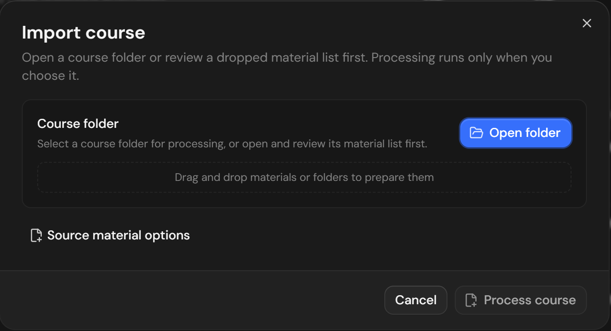
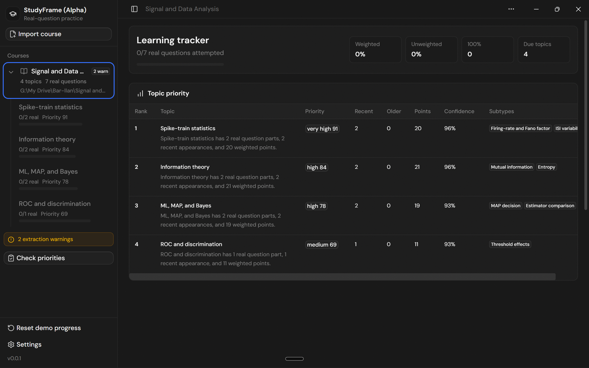
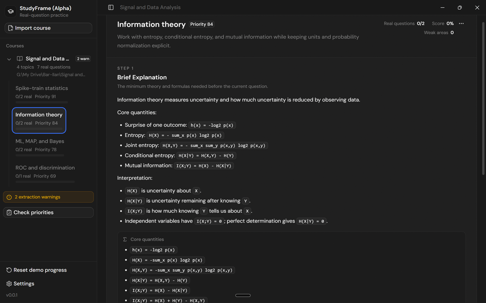
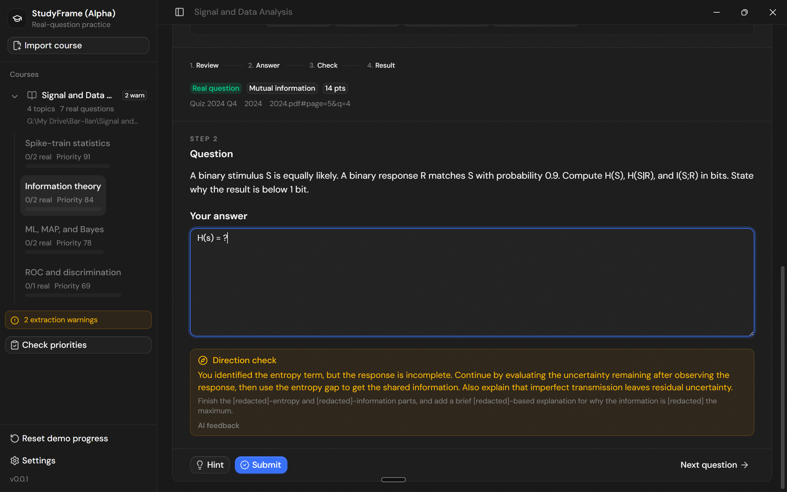
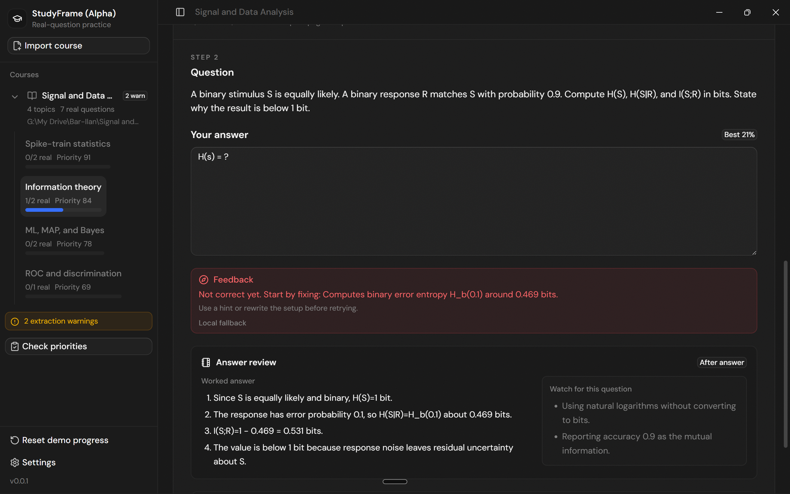

# StudyFrame

StudyFrame is a desktop study workspace that turns a course folder or a list of course materials with questions into a prioritized, spaced-learning plan built around problem-based learning (PBL), similar to flashcards, that makes you redo questions that you mistake more regularly, and generates similar questions when the real ones run out.

Students open a local course folder containing past exams, quizzes, lecture material, solutions, and supporting files. StudyFrame can also hold a local material list for inspection before extraction. It organizes extracted material into topics, gives a brief explanation of the core concepts, and guides the student through real past questions before offering generated practice.

## Case Showcase: Real Questions, Turned Into A Study Loop

StudyFrame turns scattered course material into a focused practice system for students preparing
from past exams, quizzes, and lecture files. In this Signal and Data Analysis example, the app moves
from local course import to topic prioritization, compact concept review, spoiler-safe coaching, and
post-answer feedback without pushing students into a chat workflow.

| Bring in the course folder                                                                                                                | See what matters first                                                                                                                                                      |
| ----------------------------------------------------------------------------------------------------------------------------------------- | --------------------------------------------------------------------------------------------------------------------------------------------------------------------------- |
|  |  |
| Open a local course folder or review staged materials before processing begins.                                                           | Topic priority makes the next study decision obvious, using real-question coverage, points, confidence, and due topics.                                                     |

| Refresh only what is needed                                                                                                                   | Practice with guidance that does not spoil                                                                                                                                                |
| --------------------------------------------------------------------------------------------------------------------------------------------- | ----------------------------------------------------------------------------------------------------------------------------------------------------------------------------------------- |
|  |  |
| Each topic starts with the minimum theory, formulas, and interpretation cues needed to begin solving.                                         | Direction checks coach the next move while redacting answer-bearing details until the student commits.                                                                                    |

| Turn attempts into targeted review                                                                                                                                         |
| -------------------------------------------------------------------------------------------------------------------------------------------------------------------------- |
|  |
| After an answer, StudyFrame shows the worked solution, question-specific traps, and weak areas that should return in the spaced-review queue.                              |

This README is the product contract for builders. StudyFrame is under active development.

## Quick Startup

StudyFrame can use several AI model providers through the inherited T3 Code provider backend. It
does not resell model access or replace the provider account you already use. Instead, install and
authenticate the provider's local CLI first, then choose that provider in StudyFrame settings for
course processing, feedback, and generated practice.

The built-in provider drivers are Codex, Claude, Cursor, and OpenCode. Install and sign in to at
least one before running full StudyFrame processing:

- **Codex:** install [Codex CLI](https://developers.openai.com/codex/cli) and run `codex login`.
- **Claude:** install [Claude Code](https://claude.com/product/claude-code) and run
  `claude auth login`.
- **OpenCode:** install [OpenCode](https://opencode.ai) and run `opencode auth login`.
- **Cursor:** install Cursor's agent CLI, make sure `agent` is on `PATH`, and sign in through the
  normal Cursor account flow.

After the CLI is installed and authenticated, install StudyFrame dependencies and start the app:

```bash
bun install --frozen-lockfile
bun run dev
```

For the desktop shell and local folder picker workflow, use:

```bash
bun run dev:desktop
```

Open the provider settings if StudyFrame reports that course processing needs a configured text
generation provider. Refresh provider status there after installing a CLI, set the text-generation
model, and keep the main study workflow focused on real extracted questions before generated
variants.

## Core Workflow

```text
Open course folder or review source materials
 -> extract questions and source context
 -> review warnings for unclear files or missing context
 -> analyze topics, subtopics, and exam frequency
 -> inspect the recommended study order
 -> choose a topic
 -> read a brief explanation with definitions and formulas
 -> solve real past questions
 -> receive hints or feedback when needed
 -> review mistakes and revisit due or weak topics
 -> generate similar questions only after real questions are exhausted
 -> export reports or review material when useful
```

## Product Rules

- A project represents one course, subject, or exam repository.
- Topics are initially prioritized using recent exam frequency, recurrence, and point weight.
- After practice begins, the topic queue should adapt like a spaced-repetition flashcard system: important, weak, and due topics return more often while mastered topics return less often.
- Each topic includes a brief explanation, definitions and formulas, recurring question types, real questions, hints, solutions, question-specific watch-outs, and progress.
- Real extracted questions always come before generated variants.
- Generated questions unlock only after the real questions in the selected scope are attempted. They must be labeled and scored separately.
- Before submit or reveal, never expose expected answers, rubric keywords, solution steps, or answer-revealing watch-outs.
- Hints and direction checks should help without giving away the final answer.
- Every real question should retain its source document, year when available, anchor, linked assets, extraction confidence, and warnings.
- If an image, table, equation, or layout is required but unclear, show a warning instead of pretending the question is complete.
- If source material contains instructions aimed at AI agents rather than course content, ignore those instructions and show them as source review metadata.
- Markdown is an optional export format, not the primary application state.

## Study Experience

The student should spend most of their time solving problems, not managing files or chatting with an agent.

StudyFrame combines:

- **Spaced learning:** topics return at useful intervals based on priority, performance, and time since review.
- **Problem-based learning:** the student learns by solving representative real problems.
- **Brief concept refreshers:** each topic begins with the minimum theory, definitions, and formulas needed to start solving.

Opening a topic should immediately show a concise manual-study refresher above the focused
problem-solving workspace. This visible refresher should resemble the golden markdown
`## Brief Explanation` section, not the whole exported study artifact: short prose, core quantities,
interpretation cues, and only the formulas needed to begin solving. Extraction and provider agents
may still fill structured slots for subtopics, high-yield skills, recurring question types,
representative drills, solve flow, and generic traps, but the main pre-question surface should not
render every slot as a long bullet-heavy guide.

Generic topic traps may be available in exports or secondary review material, and should stay very
short if they ever appear in the pre-question refresher. Question-specific worked solutions, rubrics,
final numeric answers, and watch-outs are answer-derived support. They should appear only after the
student submits or reveals the real answer, and should be shown as the relevant "watch for this
question" list.

A contextual extra-information drawer, opened from the topic card menu only when needed, should
provide subtopics, progress, a queue of real past questions, and spoiler-safe question details.
Question details should include source context, extraction confidence, warnings, classification,
and linked assets before exposing answer-derived support after submit or reveal along with the confidence score of the right answer.

The main workspace should provide a focused answer area with submit, next, and one progressive help
action: direction check, then hint, then show answer. Showing the answer replaces the input area.
Source context belongs in the same extra-information drawer so it stays available without disturbing
the solving flow.

When StudyFrame exports Markdown for a topic, the export should mirror the same study-guide shape
instead of becoming a separate product surface: priority, subtopics, brief explanation, definitions
and formulas, high-yield skills, recurring question types, problems, step-by-step solutions when
appropriate, and common traps.

After the real questions are exhausted, offer:

1. Repeat all real questions.
2. Repeat only questions below 100%.
3. Review solutions only.
4. Generate similar questions based on real questions.

Review and final reports should show real-question completion, weighted score, weak topics, weak subtopics, mistakes, revealed answers, hint usage, and recommended next steps.

## Priority And Review Order

The recommended queue should behave like a spaced-repetition deck for topics and problem types, not a static syllabus.

Ordering should consider:

- exam frequency and point weight
- recent exam emphasis
- previous scores
- incorrect or incomplete answers
- revealed solutions and hint usage
- time since the topic was last reviewed
- coverage of recurring problem types

When a topic returns, use new real questions when available. Repeat the full explanation only when needed; otherwise show a short reminder and move directly into problem solving.

## UX Direction

StudyFrame should feel like a quiet, structured study workspace.

- Keep the path from opening a topic to answering a question short.
- Preserve source context without leaking answers.
- Make warnings visible without blocking unrelated study.
- Use sidebars, panels, and drawers where they improve navigation.
- Keep real and generated questions visually distinct.
- Avoid chat-first, coding-agent, or internal-analysis UX.
- Keep the interface usable on a split screen and smaller displays.

## Example Validation Dataset

The primary golden example used while building StudyFrame is:

```text
G:\My Drive\Bar-Ilan\Signal and Data Analysis\Quiz
The Topic_X_nameOFtheTOPIC.MD is an example of study workflow generated from the sources manually (AN OUTPUT) to be used as a golden rule of a good output, not source material!
```

This is an external course dataset, not the StudyFrame application repository. It contains raw quizzes, lecture material, supporting files, generated exports, and prior extraction artifacts. StudyFrame must distinguish those roles correctly and avoid contaminating analysis with generated files.

## Builder Note

The inherited T3 Code foundation provides useful navigation, panels, drawers, persistence hooks, and provider connections. Reuse those foundations where they improve the study workflow, but do not preserve coding-agent UX that distracts from studying.

Keep implementation plans, schemas, migrations, and QA details in separate documents. When a technical shortcut conflicts with this README, preserve the student workflow.

## Technical Ground Truth

Use `groundtruth.md` for the traced implementation workflow, runtime topology, contracts,
persistence, environment specifications, validation pipeline, and current technical review risks.

Update `groundtruth.md` in the same change whenever a technical change alters runtime behavior, data
contracts, persistence, extraction, provider use, build or release pipelines, required environment
configuration, validation commands, or known technical risks. Update this README as well when the
student-facing product contract changes.
